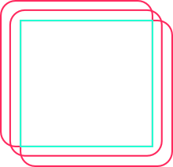

# Synthetic Data Generation

User friendly library to generate datasets using GANs and VAEs.

Paper supporting this library:
<a href="/Synthetic_Data_Generation_to_Better_Perceive_Classifier_Predictions.pdf" class="image fit">Synthetic Data Generation To Better Perceive Classifier Predictions</a>

## Installation

Use the package manager [pip](https://pip.pypa.io/en/stable/) to install generate_datasets.

```bash
pip install generate_datasets
```

## Usage

```python
from generate_datasets import data_access
from generate_datasets.wgan_gp_class_big import Big_WGAN

BATCH_SIZE = 64
EPOCHS = 1000
NOISE_SIZE = 128

Number_Dataset_Classes = 2

gan = Big_WGAN(BATCH_SIZE,NOISE_SIZE)
gan.load_dataset(data_access.prepare_data('gan'),Number_Dataset_Classes)
gan.train_model(EPOCHS)
gan.generate_images(10,"imgs")
```

If no classifier is provided to GANs, the gan model will behave like a normal gan.
The interest of one providing a classifier to our GAN model might be to better
understand how it is operating, or even to generate images of a specific class.

## Library Info

This library has several generative models at your despose:

* GAN (Generative Adversarial Network)
    * Status: Working
    * Paper: [GAN](https://arxiv.org/abs/1406.2661)
    * Official Implementation: None
* VAE (Variational Autoencoder)
    * Status: Working
    * Paper: [VAE](https://arxiv.org/abs/1312.6114)
    * Official Implementation: None
* WGAN (Wasserstein GAN)
    * Status: Working
    * Paper: [WGAN](https://arxiv.org/abs/1701.07875)
    * Official Implementation: None
* WGAN-GP (Wasserstein GAN with Gradient Penalty)
    * Status: Working
    * Paper: [WGAN-GP](https://arxiv.org/abs/1704.00028)
    * Official Implementation: None, but check this one [WGAN-GP Implementation](https://github.com/igul222/improved_wgan_training)
* PGGAN (Progressive Growing GAN)
    * Status: Not working
    * Paper: [PGGAN](https://arxiv.org/abs/1710.10196)
    * Official Implementation: [PGGAN Implementation](https://github.com/tkarras/progressive_growing_of_gans)
* IntroVAE (Introspective Variational Autoencoder)
    * Status: Not giving proper results
    * Paper: [IntroVAE](https://arxiv.org/abs/1807.06358)
    * Official Implementation: None

To learn more about these Generative models visit the referenced papers/implementations.


## Generated Images (examples)

Epochs|WGAN-GP | IntroVAE | PGGAN
------|--------|----------|------
200| |  | 
400| |  | 


## Contributing
Pull requests are welcome. For major changes, please open an issue first to discuss what you would like to change.

Please make sure to update tests as appropriate.

## Project status
On going!

## Authors and acknowledgment
Frederico Vicente & Ludwig Krippahl

## License
[MIT](https://choosealicense.com/licenses/mit/)
